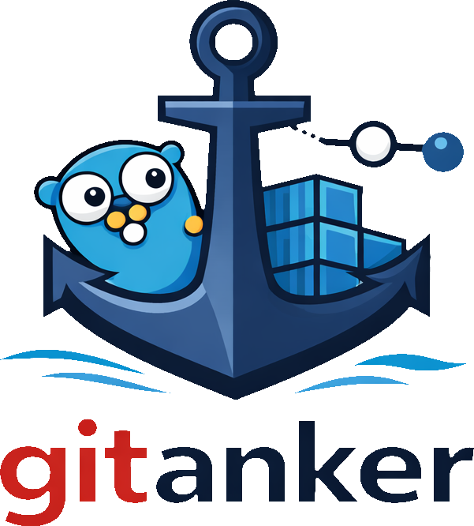

<h1 align="center">
  <br/>
</h1>

<p align="center">
  A GitOps-style agent for Docker Compose with periodic reconciliation
  and automatic rollbacks.
</p>

<p align="center">
  ⚓ Anchored to Git.
</p>

---

## Why gitanker?

I use [Renovate](https://docs.renovatebot.com/) to keep my Docker Compose
services up to date.

This means I need to periodically sync my server with my Git repository.

This can be done with a simple script:

```bash
docker compose down
git pull
docker compose up -d
```

While this works, it has several downsides:
- No drift detection:
  Changes made directly on the server are neither detected nor corrected.
- No automatic rollback:
  If a new version fails to start, the system is left in a broken state.
- No notification or observability:
  There is no clear feedback on whether a deployment succeeded or failed.


gitanker fills this gap by acting as a long-running agent that:

- Periodically checks the Git repository for changes
- Applies updates declaratively
- Detects and corrects drift
- Rolls back to the last known good state on failure
- Sends notifications on success or failure

## Project status

**Early development**

The core architecture is being built and refined.

---

## Assets & branding

These are AI generated, see Visual assets (logo, icon, favicon) are located in
the [`assets/`](./assets) directory.

- **Logo**:
  `assets/logo/`
- **Icon (CLI / repo avatar)**:
  `assets/icon/`
- **Favicon**:
  `assets/favicon/`

---

## License

Apache License 2.0.

See [`LICENSE`](./LICENSE) for details.

---

## Name origin

*Anker* is Dutch for **anchor** — a symbol of stability and holding fast.

**gitanker** reflects the idea of anchoring running systems to Git.

---

## Contributing

Contribution guidelines will be added once the core stabilizes.

For now, feel free to open issues for ideas, questions, or design discussion.

---

## Disclaimer

gitanker operates Docker workloads on your system.

Always test changes in a non-production environment first.

## AI disclaimer

Some parts of this README and other documentation have been generated using AI.
I tend to ramble on and AI helps me stay concise and focused.

AI will also be used during development, AI tends to speed up my workflow,
especially for boilerplate etc.

The artwork has been created using AI.

Without AI the project would not have any visual artwork.
For an open-source project, this is an acceptable trade-off, in my opinion.
A commercial project would warrant the involvement of a professional designer.
